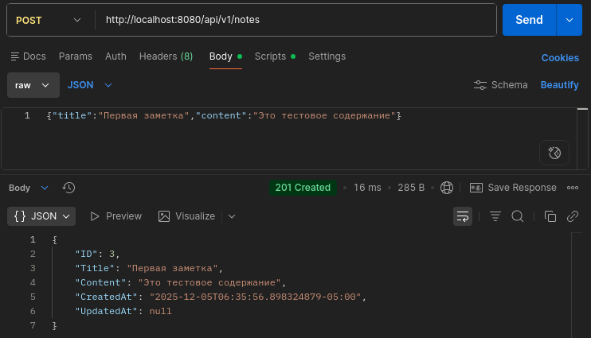
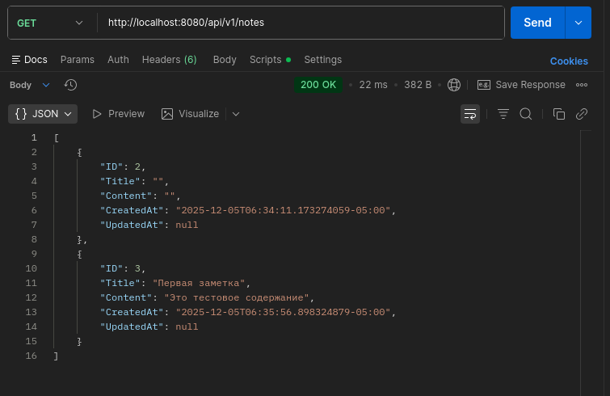
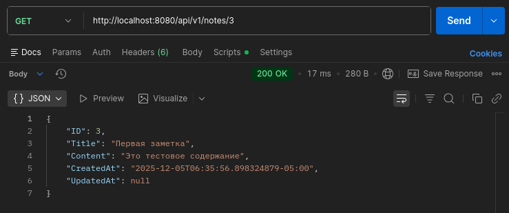
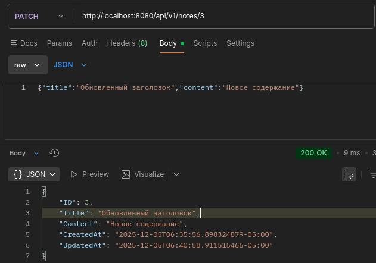
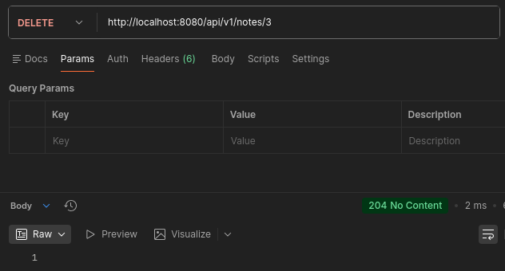
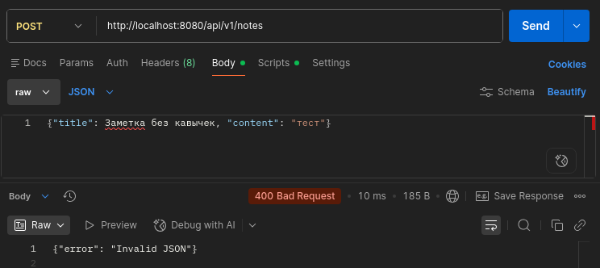
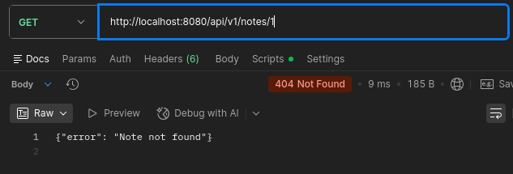
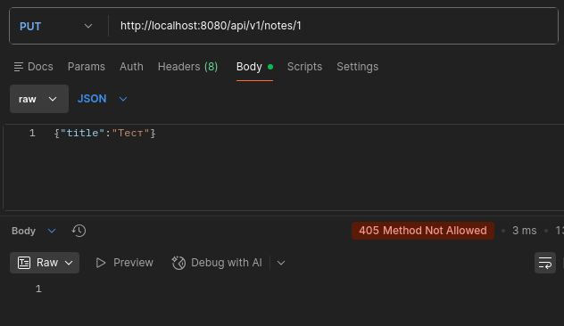

## практическа работа 11

### ЭФМО-02-25 Фомичев Александр Сергеевич

#### Структура проекта
```
notes-api/
 ├─ cmd/api/main.go
 ├─ internal/
 │   ├─ http/
 │   │   ├─ router.go
 │   │   └─ handlers/notes.go
 │   ├─ core/
 │   │   ├─ note.go
 │   │   └─ service/note_service.go
 │   └─ repo/
 │       └─ note_mem.go
 ├─ api/openapi.yaml
 └─ go.mod

```
### Цели:
1.	Освоить принципы проектирования REST API.
2.	Научиться разрабатывать структуру проекта backend-приложения на Go.
3.	Спроектировать и реализовать CRUD-интерфейс (Create, Read, Update, Delete) для сущности «Заметка».
4.	Освоить применение слоистой архитектуры (handler → service → repository).
5.	Подготовить основу для интеграции с базой данных и JWT-аутентификацией в следующих занятиях.

## реализация

В этом разделе описывается реализация ключевых компонентов приложения с объяснением назначения каждого файла и его роли в системе.

Файл: internal/core/note.go
Определение моделей данных и бизнес-сущностей.

Архитектурное значение:

- Определяет доменную модель приложения
- Отделяет структуры данных от транспортного уровня
- Обеспечивает согласованность данных между слоями

Файл: internal/repo/note_mem.go
Реализация слоя доступа к данным с in-memory хранилищем.

Архитектурное значение:

- Инкапсулирует логику работы с данными
- Предоставляет абстракцию для легкой замены хранилища
- Обеспечивает потокобезопасность

Файл: internal/http/handlers/notes.go
Обработчики HTTP-запросов, реализующие REST API.

Архитектурное значение:

- Отделяет транспортный уровень от бизнес-логики
- Обрабатывает HTTP-специфичные аспекты (коды ответов, заголовки)
- Валидирует входящие данные

Файл: internal/http/router.go
Конфигурация маршрутизации API.

Архитектурное значение:

- Централизованная конфигурация маршрутов
- Чистое разделение ответственности

Файл: cmd/api/main.go
Точка входа приложения, инициализация зависимостей.

Архитектурное значение:

- Композиция зависимостей (Dependency Injection)
- Централизованная точка запуска приложения
- Обработка ошибок запуска

## тестирование

### создаем заметки


### получение заметок


### получение конкретной заметки


### обновление заметки


### удаление заметки


### Ошибки
1) 400 — некорректный запрос;
   
3) 404 — ресурс не найден;
   
5) 405 - Метод не поддерживается
   
